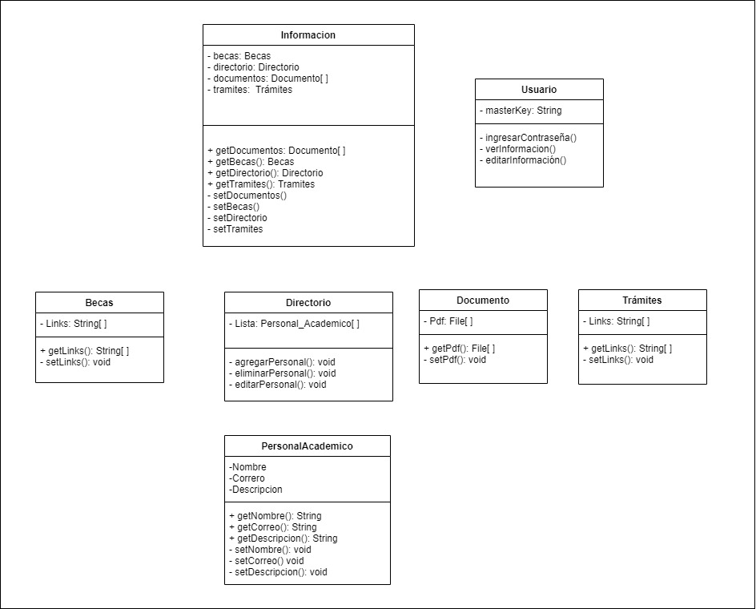
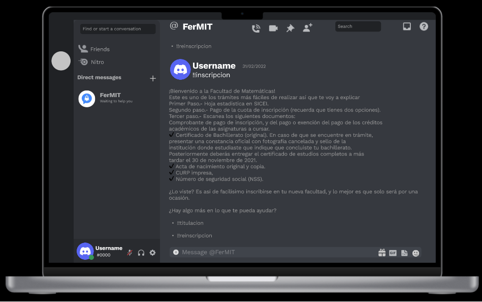
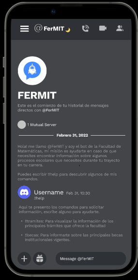

# Diagram Class

This diagram shows the classes that will be interacting in the software, these classes are:

    - Information 

    - User

    - Documents
  
    - Procedures
  
    - Scholarships
  
    - Directory
  
    - AcademicStaff

Every class has attributes, which represent its characteristics, they also have methods, which are the actions that the class must perform.

# Interface Design

For the user interface, we designed the one provided by Discord because this is the platform on which FerMIT will be hosted, for the creation of this artifact Figma software was used and two designs were created, one for viewing FerMIT on computer, while the other was for viewing FerMIT on cell phone, these designs are interactive and can be scrolled on them, as it would be done in the actual use of FerMIT.

