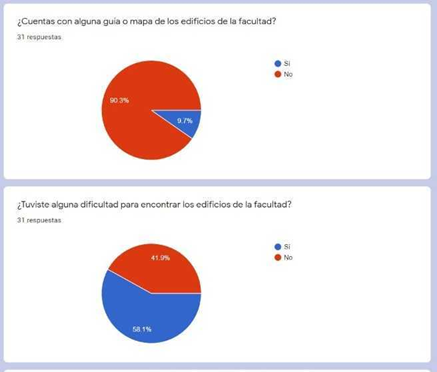
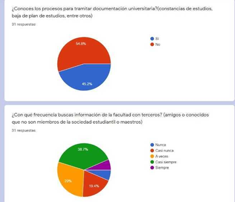
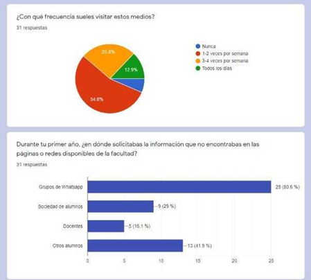
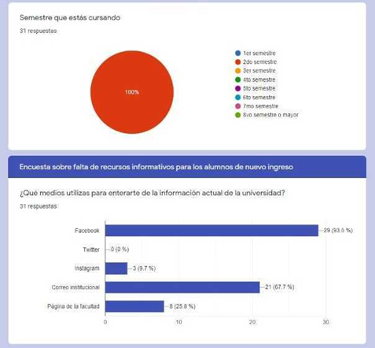
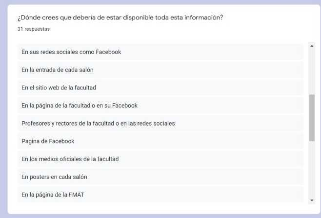
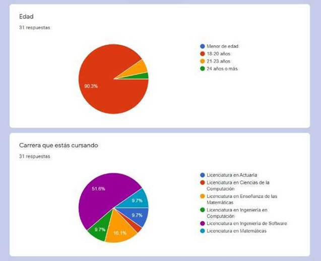

# Survey Results

Do you have any knowledge on any kind of guida or map of your faculty buildings?

Did you find difficult to look for any faculty building?

Do you know where to find all the information about the scolarships of your university?

Do you know where to find all the holidays of your faculty?

Do you know how to process your university documentation? (Studying Certificate)

How often do you look for information about your faculty with third parties (friends, people outside of the student community or teachers).

How often do you use to visit this media?

During your first year, where did you requested information that you couldn't find on the 
official websites or social media available on your faculty.

What semester are you cursing now?

What media sources do you use to get involve of the current information of your faculty.

Where do you think all this information should be available?

How old are you?

What college degree are you cursing?

