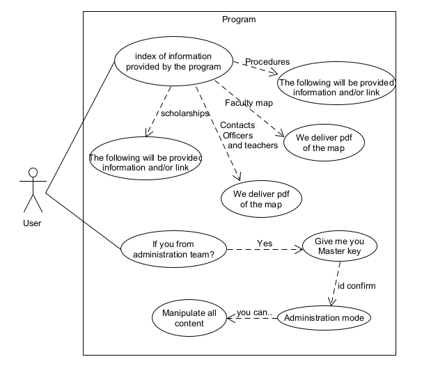

# Requeriments

## Index

* [Survey and survey analisis](#Item0)
* [Main objective](#Item1)
* [User Profile](#Item2)
* [Scope and limitations of the project](#Item3)
* [Functional Requirements](#Item4)
* [Requerimientos No Funcionales](#Item5)
* [Diagram Case](#Item6)

## Survey and survey analysis

In search of the problem of misinformation of our partners, we decided to make a survey to validate our suspicions. And based on the [results obtained](Graphics.md), we carried out the documentation of the project.

## Main objective 

Build a software system capable of reducing the lack of information for the new students of the UADY´s Mathematics Faculty.

## User Profile 

Students of the UADY´s Mathematics Faculty. with an average of 18-22 years old who study any of the first 3 semesters, which presents difficulties obtaining information related to the faculty.

## Scope and limitations of the project 

### Scope 

1. The users will be the UADY´s Mathematics Faculty students, focusing on the students who are studying the first three semesters in the faculty.
   
2. The main media outlet will be the faculty’s student council.
   
### Limitations 

1. The system will not register nor enroll in courses or scholarships.
   
2. The system will not work as a means of communication with the faculty authorities.

## Functional Requirements

|User requirements|
|-----------------|

| RF01 | Provide the information |
|----------| ------ | 
| Priority | High  |
| Description | The system will provide the user with hyperlinks to the websites required to carry out processes, registrations, and procedures. |

| RF02 | Provide the sketch document  |
|--------| ------ | 
| Priority | High  |
| Description | The system will provide a PDF document with the faculty sketch when requested by the user. |

| RF03 | Provide the current school calendar  |
|--------| ------ | 
| Priority | High |
| Description | The system will provide a PDF document with the school calendar when the user requests it. |

| RF04 | Edit and update information  |
|--------| ------ | 
| Priority | High  |
| Description | The system will have the necessary tools to edit and update the contents of the system. |

| RF05 | Authenticate maintenance equipment |
|--------| ------ |
| Priority | High  |
| Description | The system will validate the access of the maintenance team to the editing section of the system.|

| RF06 | Access to scholarships  |
|--------| ------ | 
| Priority | High |
| Description | The system will provide the information related to the scholarships published in the institutional mail and/or on the website of the Institutional Scholarship Program. |

|Students requirements|
|---------------------|

| RF07 | Studies revalidation  |
|--------| ------ | 
| Priority | Medium |
| Description | The system will provide information about the procedures and documentation needed for the revalidation of studies. |

| RF08 | Location for the revalidation of studies |
|--------| ------ | 
| Priority | High |
| Description | The system will provide information about the location of the physical offices to make the revalidation of studies. |

| RF09 | First inscription process  |
|--------| ------ | 
| Priority | High |
| Description | The system will answer related questions about the first-inscription process to the UADY´s Faculty of Mathematics. |

| RF10 | First inscription process questions  |
|--------| ------ | 
| Priority | High |
| Description | The system will answer related questions about the first-inscription process to the UADY´s Faculty of Mathematics. |

| RF11 | Re-inscription process  |
|--------| ------ | 
| Priority | High |
| Description | The system will provide information to the user about the necessary documentation for the re-inscription process. |

| RF12 | Re-inscription process (Lost of payment) |
|--------| ------ | 
| Priority | High |
| Description | The system will provide information about what to do in the specific situation of a lost payment in the re-inscription process. |

| RF13 | Free-subject course discharge  |
|--------| ------ | 
| Priority | High |
| Description | The system will provide information about the necessary steps to discharge a free-subject course. |

| RF13 | Free-subject course discharge  |
|--------| ------ | 
| Priority | High |
| Description | The system will provide information about the necessary steps to discharge a free-subject course. |

| RF14 | Optional-subject course discharge  |
|--------| ------ | 
| Priority | High |
| Description | The system will provide information about the necessary steps to discharge an optional-subject course. |

| RF15 | Studies constancy process  |
|--------| ------ | 
| Priority | High |
| Description | The system will provide information about the procedures needed to obtain a study’s constancy. |

| RF16 | Students’ degree process  |
|--------| ------ | 
| Priority | High |
| Description | The system will provide information about the procedures and documentation needed for the student’s degree. |

| RF17 | Countability debt constancy |
|--------| ------ | 
| Priority | High |
| Description | The system will provide detailed information about the importance and functionalities of the countability debt constancy. |

|Information requirements|
|------------------------|

| RF18 | Scholar drop & no re-inscription  |
|--------| ------ | 
| Priority | High |
| Description | The system will provide detailed information about the difference and importance of the scholar drop and no re-inscription processes. |

| RF19 | Free-subject & Optional-subject courses drop dates  |
|--------| ------ | 
| Priority | Medium |
| Description | The system will provide information about the free-subject and optional-subject courses drop dates. This information is changed each semester. |

| RF20 | Statistical sheet update date  |
|--------| ------ | 
| Priority | Medium |
| Description | The system will provide information about the statistical sheet update date. This information in changed each semester and its only for the re-inscription process. |

| RF21 | Statistical sheet update outdated  |
|--------| ------ | 
| Priority | Medium |
| Description | The system will provide information about the steps needed for an outdated statistical sheet. |

| RF22 | Optional-subject courses catalog  |
|--------| ------ | 
| Priority | Medium |
| Description | The system will provide an optional-subject courses catalog. This information is from the next semester, it’s going to be changed each semester and needed to be published before the optional-subject course selection. |

| RF23 | Failed free-subject course  |
|--------| ------ | 
| Priority | High |
| Description | The system will provide information about the steps to follow when a student has a failed free-subject course. |

| RF24 | Academic charge blocks  |
|--------| ------ | 
| Priority | High |
| Description | The system will provide detailed information about the functionalities and importance of knowing how academic charge blocks works. This information is only for the UADY´s Faculty of Mathematics students. |

| RF25 | Federal scholarship & Institutional scholarship  |
|--------| ------ | 
| Priority | High |
| Description | The system will provide detailed information about the difference between federal scholarship and institutional scholarship. |

| RF26 | CISCO academy courses  |
|--------| ------ | 
| Priority | High |
| Description | The system will provide information about the CISCO academy courses and its relationship to UADY´s Faculty of Mathematics students. |

| RF27 | CISCO academy courses inscription  |
|--------| ------ | 
| Priority | High |
| Description | The system will provide information about all the available courses and the steps needed for the course inscription of the CISCO academy courses. |

## No Functional Requirements

| RF01 | Sources of information  |
|--------| ------ | 
| Priority | High  |
| Description | The system will use information obtained through the official sites of the faculty, which are: the website of the faculty, Facebook of the faculty, institutional mail, and the website of the Institutional Scholarship Program. |

| RF02 | Contact Information  |
|--------| ------ | 
| Priority | Medium |
| Description | The system will use the information from the directory of the mathematics faculty website and should additionally include brief explanations about the functions of each authority in the faculty.   |

| RF03 | Updating information  |
|--------| ------ | 
| Priority | High  |
| Description | The system should be updated by the maintenance team to have the latest information regarding the official media. |

| RF04 | Quick Access  |
|--------| ------ | 
| Priority | High  |
| Description | The user will be able to access the information found in the system with minimal interactions. |

| RF05 | Public access  |
|--------| ------ | 
| Priority | High  |
| Description | The system will allow free access to the information. |

## Diagram Case

