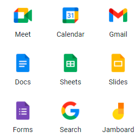
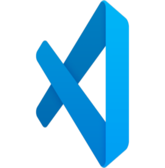

# Methodology

The team has a work philosophy that emphasizes intuition, emotional health and teamwork, the team has the ability to make decisions about their action plans for their assigned tasks and the freedom to choose their co-workers who will help them to finish their goal. Our methodology is based on a hybrid of SCRUM and waterfall, since we have a sprint of approximately 3 weeks where we are increasing the product stack with new artifacts that will allow us to see the results of the product. At the end of each sprint we launch a validation survey to create new User Stories that allow us to have a clear vision of whether what we are doing is the right thing.

# Team tools

## Google tools

### Meet and Calendar

We use Meet to have our team meetings and Calendar for direct notification to email and mobile notifications to meetings. We also use teams (for microsoft) for special meetings with our teacher.

### Docs

Everything that needs to be documented was done here. It was really useful for the different ways of writing and a collaborative work that everyone had access to the file.

### Slides

We used a Slides document to keep notes of what was discussed and talked about at each different meeting.

### Sheets

We use it to create our contribution metrics and to keep track of dates.

### Forms

By this means we create the surveys that are necessary to get feedback from our users regarding our research progress and creation of the system.

## Visual Studio Code

Visual will be the medium through which we create our system, while we also use it to have a better visibility at the time of coding.
Something to highlight is the fact of using "live share" to work together for the same code.

