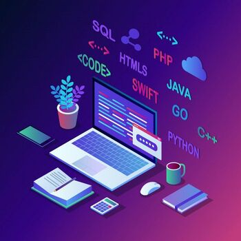

# (Name proyect)

## Team Members

 [Cruz Inzunza Luis Alejandro](https://github.com/Luis-Inzunza)

 [Fonseca Loria Adrian](https://github.com/adrianfonsecal)

 [Magaña Garcia Jose Angel](https://github.com/Xmahana)

 [Medina Avila Luis Miguel](https://github.com/LuisMiguelMedina)

 [Perez Cruz David Leobardo](https://github.com/DavidPerez007)

## About our work

We are from software engineering in 2nd semester working in a better way to obtain the most important and interesting information and notice from the page of us university UADY (Universidad Autonoma De Yucatan) more specifically from the faculty of mathematics and faculty of chemistry.

## index

* [Requirements](Files/Requirements.md)
* [Standar Coding](Files/StandarCoding.md)
* [Work Method and Organization](Files/WorkMethod.md)
* [Logbook](Files/LogBook.pdf)

## First Stage

* [Material of presentation]()

* [Metric of Progress]()

* [Video presentation]()

